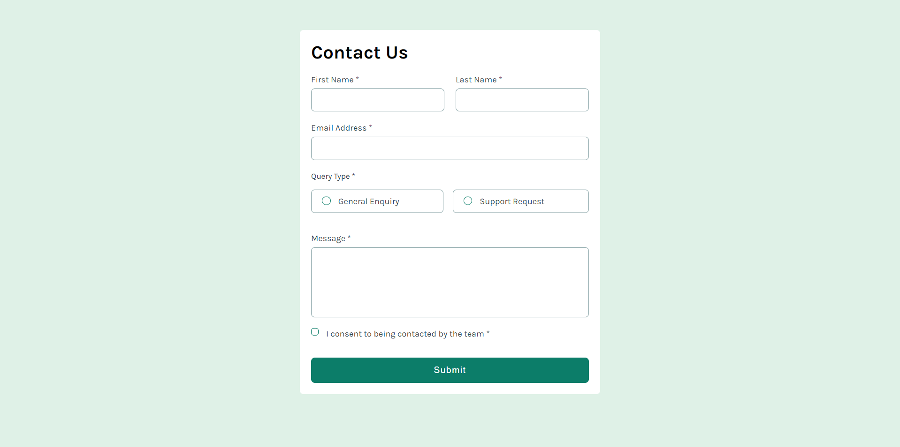
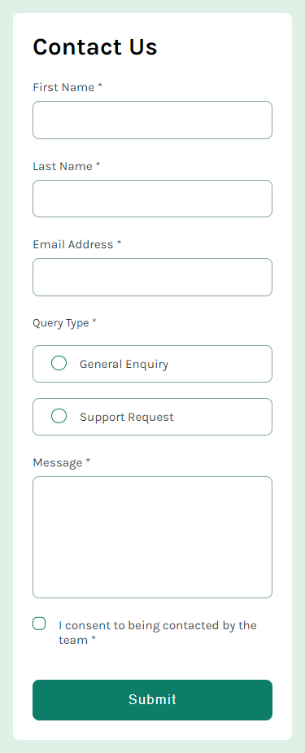

# Formulario de contacto

_"Este proyecto es una propuesta de solución para uno de los desafios de Frontend Mentor, todos los recursos utilizados fueron obtenidos mediante dicha plataforma"_

El contenido de este repositorio contempla el desarrollo de una página web en la que se muestra un formulario de contacto, solicitando datos típicos como nombre, apellido y correo electrónico, en conjunto con otros datos relacionados.

## Contenidos

- [Descripción](#descripción)
  - [Desafío](#desafío)
  - [Screenshot](#screenshot)
  - [Links](#links)
- [Proceso](#proceso)
  - [Hecho con](#hecho-con)
  - [Lo que aprendí](#lo-que-aprendí)

## Descripción

### Desafío

El desafío propuesto fue diseñar un formulario de contacto interactivo y accesible para diferentes usuarios que necesiten utilizarlo, esto tomando en cuenta las discapacidades o condiciones que pueda tener cada cliente.

### Screenshot

#### Escritorio

#### Movil

### Links

- Sitio: [-](#)

## Proceso

### Hecho con

- HTML
- CSS
  - Flexbox
  - CSS
  - Flujo de trabajo _Mobile-first_
- JavaScript

### Lo que aprendí

Para este proyecto aprendí a manejar de una mejor manera los eventos _submit_ en JavaScript, especificamente al momento de enviar el formulario y evaluar los valores enviados o no, de manera que se pueda visualizar en pantalla los valores no enviados o incorrectamente ingresados. Como ejemplo puedo tomar como caso el ingreso del correo electrónico, en la que se utilizó una __expresión regular___ para validar el formato (los correos siempre deben contener un @).